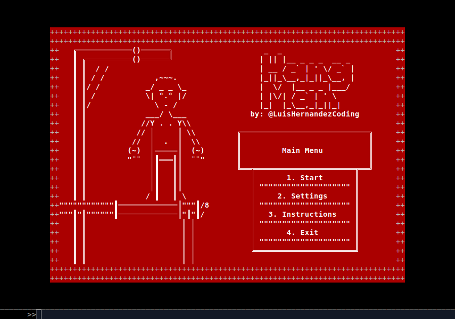

# Hangman Ruby

In this project, i built a Hangman game that can be executed on the console, it can be played on 2 languages and 3 difficulties, also it can be saved and loaded

The main goal is to put into practice main concepts from File Managing and serialization



###### Definition

> 'Hangman Game (American English), its a game where a player tries to guess a word by suggesting letters within a certain number of guesses. The word to guess is represented by a row of dashes, representing each letter of the word.

###### Behavior

The player guesses one letter at a time, if the letter is in the word, the program writes it in all its correct positions. If the letter does not appear in the word, the player loses a point. If the player completes the word before losing all the points, he wins.

## Built With

- Ruby v 3.1.2p20

## Getting Started

To get a local copy up and running follow these simple example steps.

### Prerequisites

- Ruby v 3.1.2p20

### Setup

- Make sure you have Ruby installed on your machine
- Clone this repository with
```bash
git clone git@github.com:LuisHernandezCoding/Hangman_Ruby.git
```

### Usage

- Run the program on your local machine with 

```bash
ruby bin/main.rb
```

## Author

👤 **Luis Hernandez**

- GitHub: [@LuisHernandezCoding]

## Credits

- Project made mainly for 
[The Odin Project](https://www.theodinproject.com)
[(Full stack ruby on rails)](https://www.theodinproject.com/paths/full-stack-ruby-on-rails/courses/ruby)
[Ruby Hangman](https://www.theodinproject.com/lessons/ruby-hangman)